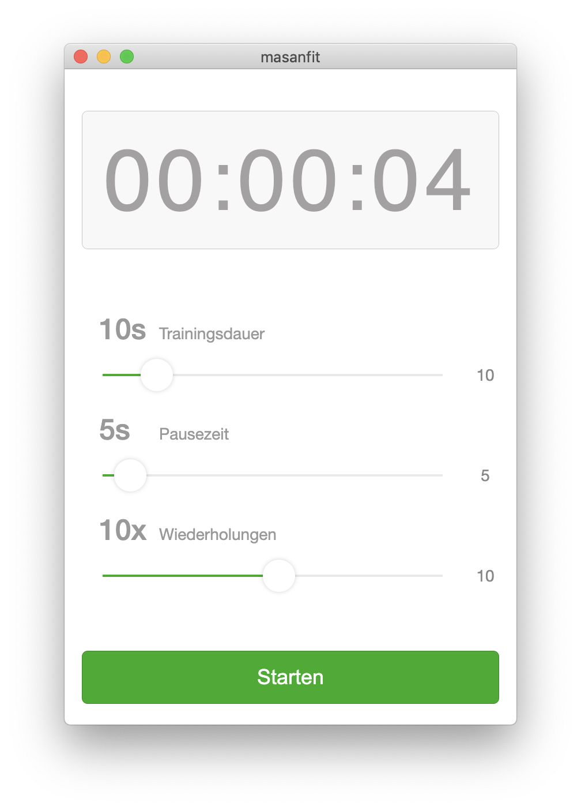

<div align="center">
  <h3>A minimal fitness timer</h3>
  <p>Two sound alerts for interval training: the long alert for starting; the shorter one for changing. </p>

  <p>
    <a href="#">
      
    </a>
    <a href="#">
      
    </a>
  </p>
  
</div>

---

## Live [Demo](https://masanfit.netlify.app/)


## Getting started
```bash
npm install
npm run start
npm run build 
```

## licence

MIT [@vikbert](https://vikbert.github.io/)


